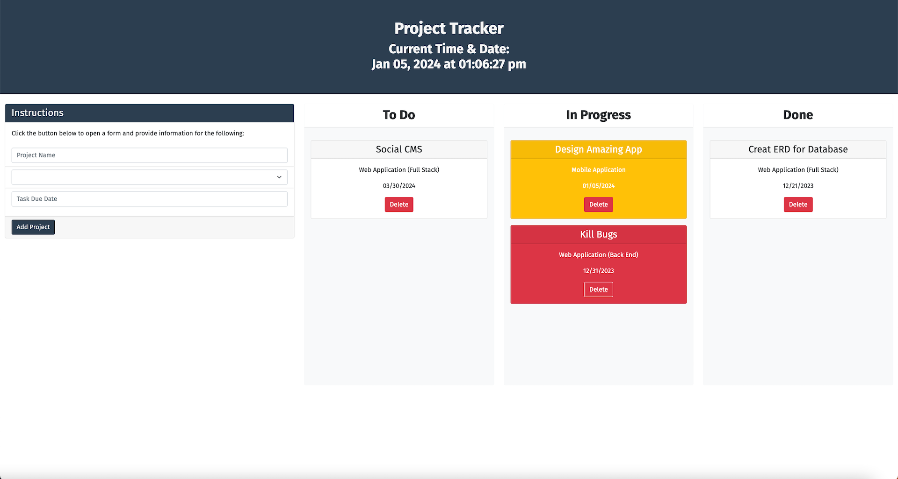

# Module 5 Mini-Project: Interactive Project Management App

This mini-project involves building a front-end focused interactive project management application using jQuery, HTML, CSS, and client-side storage technologies. The app will enable users to organize and manage their projects efficiently.

## User Stories

* As a user, I want to view and manage all my projects in one place.

* As a user, I wish to add new projects with details like name, type, and due date.

* As a user, I want to have the ability to drag and drop projects between different statuses (e.g., To-do, In Progress, Done).

* As a user, I want to delete my projects.

## Acceptance Criteria

* It's done when the homepage dynamically displays a list of all projects stored in the browser's local storage.

* It's done when projects can be added through a form, with the details stored in local storage.

* It's done when each project can be viewed and deleted directly from the UI.

* It's done when the UI updates in real-time to reflect changes made to the projects.

* It's done when projects are organized based on their status (e.g., To-do, In Progress, Done) and can be dragged between these statuses.

* It's done when the background color of each project dynamically changes based on its due date.

## Assets

The following image demonstrates the web application's appearance:

## Specifications

* Navigate to `Develop/assets/js/script.js` and complete the tasks marked by `TODO:` comments.

* The app will be a single page, utilizing jQuery for dynamic content manipulation.

* Local Storage will be used to persist project data across sessions.

* Projects will have attributes like `id`, `name`, `type`, `dueDate`, and `status`.

* The UI will feature draggable project cards for intuitive interaction.

* A live time display will be present, updating every second.

---

## Hints

* Utilize jQuery extensively for DOM manipulation and event handling.

* Store project data in Local Storage and ensure the UI stays in sync with this data.

* Explore jQuery UI's draggable and droppable features for interactive project cards.

---
© 2024 edX Boot Camps LLC. Confidential and Proprietary. All Rights Reserved.
